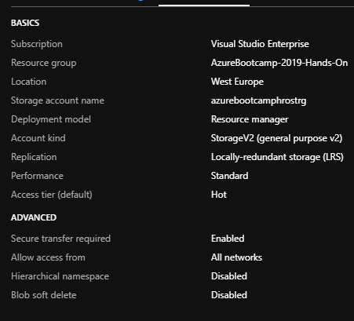
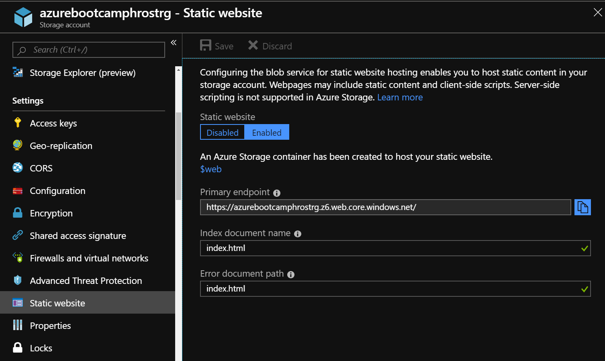
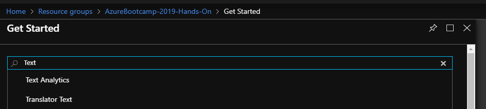
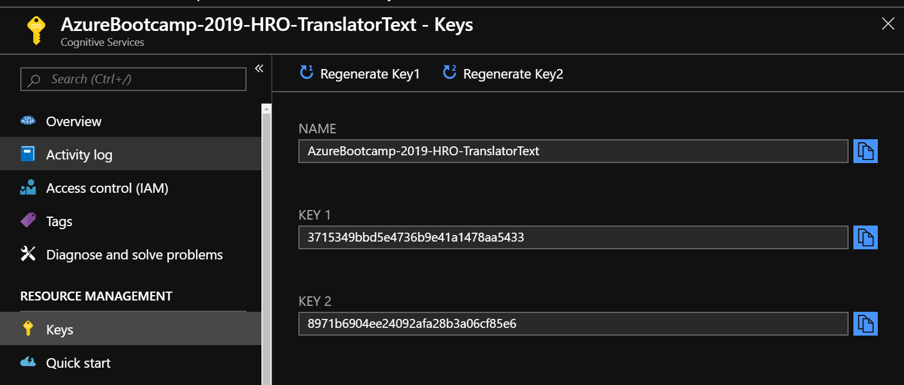
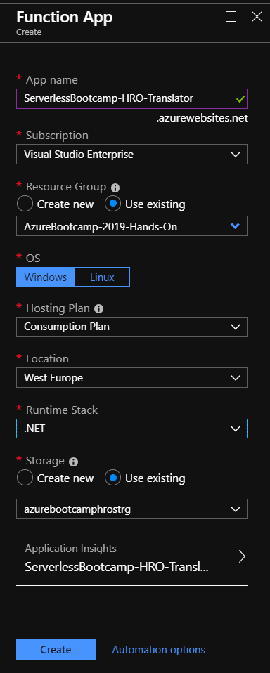
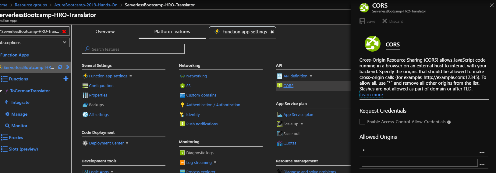
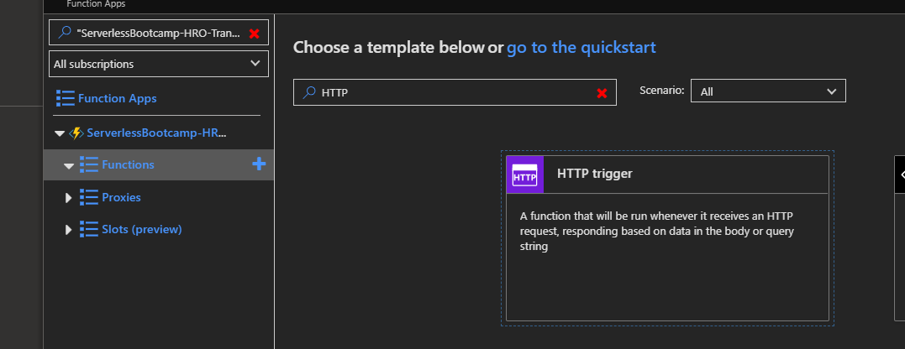
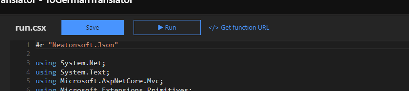

# Introduction 
This repository is used to support a Hands-On Session "*Serverless and Functions*".

After performing all steps you will be able to navigate a browser to a website, enter text in different languages and get translated (to german) text with a sentiment back. This data is shown on the page.

# Getting Started
This guid consists of multiple parts:
1.	[Setup Azure Services](#Setup-Azure-Services)
2.	[Upload Function](#Upload-Function)

# Setup Azure Services
To group the necessary services, it is recommended to use a separate resource group. In that group you need to create the following services:

- [Storage Account](#Storage-Account)
- [Cognitive Services](#Cognitive-Services)
- [Function App](#Function-App)

Logon to the [Azure Portal](https://portal.azure.com) and navigate to the previously create Resource Group, or create a new one.

## Storage Account
Create a storage account and set the Account kind to **StorageV2 (general purpose v2)** and use **LRS** as Replication. 

Next activate the static website hosting feature (currently in preview).


Please enable the **Static website** feature and set the Indes and Error document to *index.html*. This demo will not use a dedicated error document. Hint: The endpoint field will be visible only after you click on the Enabled button.

## Cognitive Services
The solution uses the services *Text Translation* and *Text Analytics*. Both of them need to be create separately.

Both can be create by clicking on add and entering "Text" as filter.



Create both services mentioned above and remember the keys.



The keys will be used later, to authenticate in order to use the services.

## Function App
Part of the solution is an Azure Function that leverages two Cognitive services for a passed text.
So let's create a Function App.



Use the same Resource Group that you've been using for the storage account and Cognitive Services. Select **Windows**, **Consumption Plan** and **.NET**. 

Remember the keys you needed to write down in the previous chapter? Grab them, because we need them now.
Since we do not want to use keys in the sourcecode itself, we'll place them in the application settings and access them through environmental variables. That way the can be changed on the fly and are not stored in a sourcecontrol system.

---
In case you get a white page when navigating to your Function App, try another browser.
***

Go to the Platform features blade from where you can access the Application and CORS settings.



1. Go the the application settings of the Function app and add the access keys in the **Application Settings** section.

   | Key | Value |
   | --- | ----- |
   | ANALYTICS_TEXT_KEY | 20de52f548644252bfe152bef6bce675 <-- this should be YOUR key |
   | TRANSLATOR_TEXT_KEY | 474261fde8894fd59a74e081665a30b2 <-- this should be YOUR key |

2. Set a CORS policy

   Otherwise the browser would query for data later on, but not show anthing of it and hide the error in the console.

   Remove all existing entries and add one **ALLOWED ORIGINS** with the value "*" (just a star) or add the URL of your static website in the azure storage account: https://\<storage account name>.z6.web.core.windows.net.

### Further Reading ###
In case you want to know more (or create your own Function) the links will enable you to do so: 
- [https://docs.microsoft.com/en-us/azure/azure-functions/functions-create-first-function-vs-code](https://docs.microsoft.com/en-us/azure/azure-functions/functions-create-first-function-vs-code)
- [https://docs.microsoft.com/en-us/azure/cognitive-services/translator/quickstart-nodejs-translate](https://docs.microsoft.com/en-us/azure/cognitive-services/translator/quickstart-nodejs-translate)

# Upload Function

## Get the Function data
Download the files from ```https://github.com/ArvatoSystems/AzureBootcamp-2019-HandsOn-Functions.git``` and unzip this archive.

Finally we can deploy our website and Function to see the magic happen.

1. navigate into the subfolder **functions/TextTranslator**
2. navigate to the function apps and create a function

3. upload an overwrite the run.csx
4. The newly deployed function has its own URL. We need it for the website to be able to leverage the function. So go to the function in your browser and copy the URL.
    
5. Open the **Website** folder of the cloned repository with VSCode.
6. Adjust the Function App URL in the **variables.js** files. Set the variable **functionUrl** to the value of your Function App.
7. Navigate to the Storage account in your browser and click on the **$web** container.
8. Upload **index.html**, **demo.min.css**, **demo.min.js** and **variables.js** from the websites folder. You can use drag&drop or the Upload button in the Portal.

That's it. Get back to the Storage account in the browser to copy the URL from the *Static website* blade.
